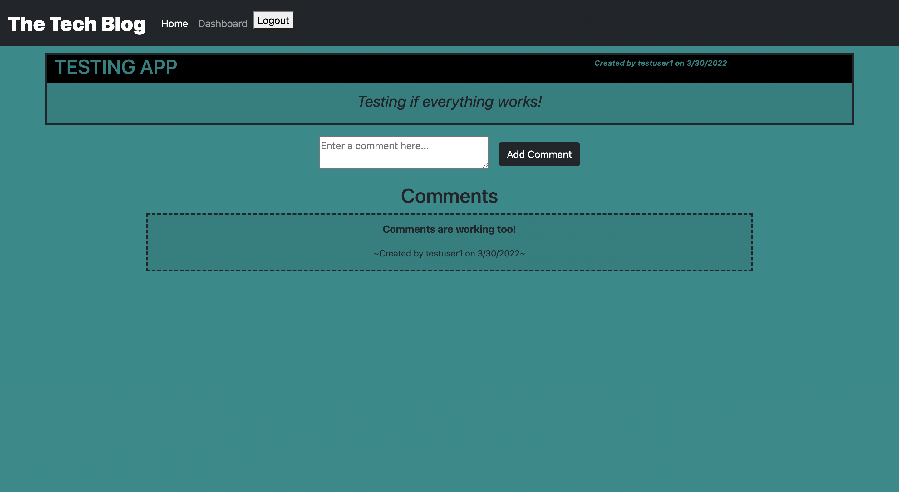

# Tech-Blog

## Table of contents:

- [Description](#description)
- [Usage](#usage)
- [Contributors](#contributors)
- [Questions](#questions)

### Description:

This application is a CMS-style blog site similar to a Wordpress site, where developers can publish their blog posts and comment on other developers’ posts as well. This application follows the MVC paradigm in its architectural structure, using Handlebars.js as the templating language, Sequelize as the ORM, and the express-session npm package for authentication.

Screenshots of running program:  

### Usage:

    You can view my deployed website here:[TechBlog](https://aden-abdirahman.github.io/Tech-Blog/) or find my project on my github page and clone it to your local computer for your personal use .

### License:

This project is licensed under: MIT

### Contributors:

Abdirahman

### Questions:

If you have any questions contact Abdirahman on [Github](https://github.com/aden-abdirahman)
or [Email](https://aden.abdirahman45@gmail.com)
